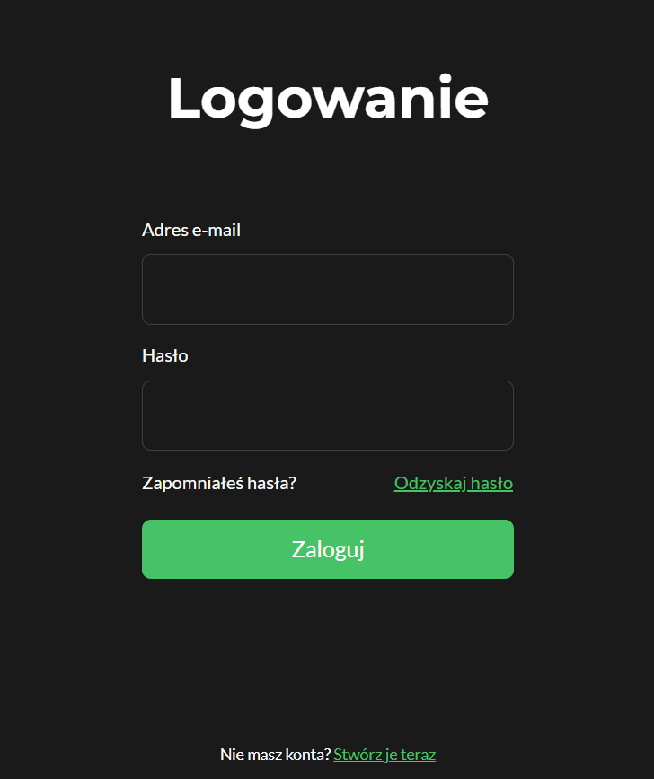
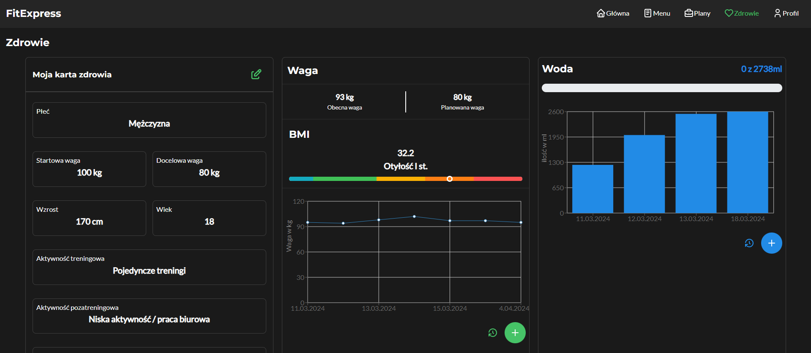

# FitExpress - a diet food catering service
This repository contains source code of the FitExpress app. To be precise, the app used by the end user (check out the admin panel repo [here](https://github.com/SquirrelloDev/FitExpress-admin)).
FitExpress is a diet food catering service build with PWA capibilities which primary goal is to help the users to lose weight by providing the personalized plans.
**WARNING!** The live backend server is shut down. Any performed request is going to result with an error. Please refer to the [installation guide](#installation) to test the app locally
## Table of Contents
- [Techstack](#techstack)
- [Features](#features)
- [Screenshots](#screenshots)
- [Instalation](#installation)
## Techstack
Technologies and libraries used for building the app:
- React
- Mantine
- React hook form
- React-select
- React date-picker
- Tanstack react query
- Zustand
- Stripe.js
- Axios
- Date-fns
- Recharts
- TypeScript
- SCSS
- VitePWA
- PWA features: notifications, localization
## Features
- **JWT** based authentication
- Daily calories and water demand calculation which is used later in the app
- Fully implmented ordering process with **Stripe**
- Everyday meal selection for the specific diet types
- Diary based tracking progress of weight loss and water intake
- **PWA** notifications as a reminder for taking a meal, selecting desired meals for the next day and filling the weight loss/water intake diary
- **PWA** access to the device's localization module in order to fill in address data faster
- Checking if the filled address is in range of delivery
- Promocode copying to the clipboard via **Clipboard API**
### To-do
- Log in via OAuth services
- Add Exclusion database feature in order to browse all possible exclusions
## Screenshots
<p align='middle'>


</p>
<p align='middle'>


</p>


## Installation
### Requirements
#### Technical requirements
- ```node.js ver. >= 16.16.0```
- ```git```
#### Additional requirements
To work properly, the backend server should be running. The backend server repository is located [here](https://github.com/SquirrelloDev/FitExpress-back).
To test the API in dev enviroment, replace the ```endpointURL.prod``` to ```endpointURL.dev``` in the ```/src/utils/api.ts``` file
### Instruction
1. Clone the the repository:
```shell
git clone https://github.com/SquirrelloDev/FitExpress-front
```
2. Install dependencies
```shell
npm install
```
3. Run the local server
```shell
npm run preview
```